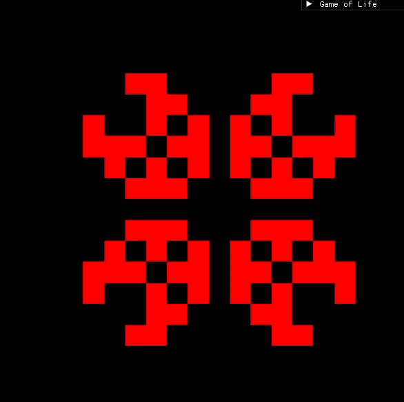

# Conway's Game of Life
Implementation of Conway's Game of Life with c++ 23 and SFML 3.1 including ImGui.
The project uses a 1D grid, double-buffered board, and draws the cells using vertices.

# Building
The project uses CMake and fetches its dependencies automatically using FetchContent.

Requirements:

- CMake 3.28+
- C++23 compatible compiler
- Git

Clone the repository and configure/build it with CMake.

# Controls
- Left Mouse: Place cell
- Right Mouse: Remove cell
- WASD: Move view
- Mouse Wheel: Zoom
- Spacebar: Play/Pause
- G: Draw grid
- R: Randomize cells
- C: Clear cells
- H: Reset view

# About
This was a learning project primarily focused on cellular automata, simulation logic,
and rendering a large number of cells efficiently using vertices and triangles.

I also learned a lot about using sf::view, array/grid indexing and probably other things...
It took me longer than I initially expected because I suck at maths.

This is also the first project where I have seen tangible value out of optimization which was very cool.